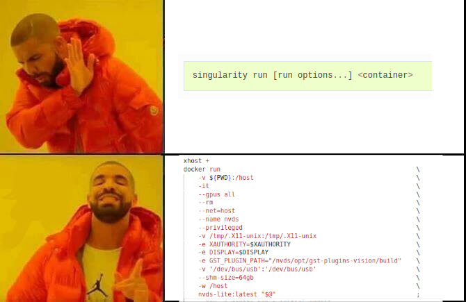

# Painlessly running GUIs inside Docker containers

A sample on how to run docker containers that can display GUI elements without external commands or `xhost` safety concerns:

```
git clone https://github.com/pabsan-0/docker-painless-guis docker-guitest
cd docker-guitest

docker compose build
docker compose run guitest
```

Once inside of the container, run the following:
- `firefox`: should not run if you're root, but simply do `su gumby` and try again as user
- `nautilus`: should run out of the box as either user `root` or `gumby`.

<br>

<br>

For more details, continue reading. Else, just copy the templates and continue your proj.


## Docker run arguments

The docker compose file in this gist is basically running this command:

```
docker run 
  --[*extra-args]
  --volume /tmp/.X11-unix:/tmp/.X11-unix:rw   # See https://unix.stackexchange.com/a/196680
  --volume $XAUTHORITY:$XAUTHORITY            # Shared xauth token
  --env QT_X11_NO_MITSHM=1                    # Helps sometimes with weird apps
  --env DISPLAY=$DISPLAY                      # The display to use
  --env XAUTHORITY=$XAUTHORITY                # Where to find xauth token 
```


## The xhost+ paranoia

Your host machine has a default access list to your X server. Run `xhost` to see it, something like this should pop out by default:

```
access control enabled, only authorized clients can connect
SI:localuser:your_user_name
```

Common external `xhost` mods to achieve X server access are laid below, though take note actively using these commands is typically unsafe:

- `xhost + `: grants access to anyone, the unsafest option of all
- `xhost +local:root`: grants access to any local connections. I could not figure the `root` part
- `xhost +SI:localuser:root`: grants acces to the root user of your machine. Though I cannot make any promise, it looks way safer than the above
- `xhost +SI:localuser:your_user_name`: grants acces to current user of your machine. This option is enabled by default


Docker connections are generally local, though you may encounter non-local `xhost` needs when sharing GUIs over SSH or similar, though such scenarios are left outside the scope of this gist.


## The $XAUTHORITY path

Better than allowing external connections through `xhost` is sharing an X server access token with your docker containers through volumes through `$XAUTHORITY`, however there are some user-level related limitations with this.

The `$XAUTHORITY` env variable we are sharing should be a user-id-dependent path (notice the `1000`) and looks like:

```
user@ubuntu20.04:~$ echo $XAUTHORITY 
/run/user/1000/gdm/Xauthority
```

Some internet results use the variable `$XAUTH` rather than `$XAUTHORITY`. Check if `$XAUTH` is defined in your host's shell. It wasn't in mine, so my guess is this depends on your OS version.


## Examples

Build the default image with `docker compose build` and try the following examples if you like for a walkthrough of different scenarios. 

We will be running two graphical applications for these:

- `firefox`: standard web browser. Has some root-related issues sometimes 
- `nautilus`: standard file explorer which should always work in a healthy environment

Here's a refresher for some commands we'll be using:

- Switch to a different user `gumby` in a subshell: `su gumby`
- Come back from a subshell to previous user: just press `^D`
- See user ids and a bit more: `cat /etc/group`

By default, Ubuntu 20.04 gives each non-root user an ID starting at 1000. If your host's user ID is not 1000, you'll probably get different outcomes in thes examples. The ID of root should be 0.

### Sharing $XAUTHORITY

Build and run the default `docker compose run guitest`, which is passing all run arguments seen above including the `$XAUTHORITY` token as a volume plus an env variable telling its location. You'll log in as root by default: 

- As `root`: We cannot run `firefox` because there is a XAUTHORITY in place for an user other than `root` and the access to the xserver is limited by the `firefox` application. You can run `nautilus`, though, which has no `root` `$XAUTHORITY` restrictions.
- As `gumby`: Switching to an user `su gumby` with the same user id than our host's user (first user in ubuntu defaults to 1000) does allow `firefox` to run. 
- As `gumby2`: Switching to a different user `su gumby2` with a different user id will forbid us from using the token at `$XAUTHORITY` and no GUI will be displayed. 


### Default xhost +SI:localuser:user

Make sure your `xhost` looks like this (default value), then run `docker compose run guitest_noxauth`, which is not passing a `$XAUTHORITY` token.
```
access control enabled, only authorized clients can connect
SI:localuser:your_user_name
```

- As `root`: No display is found to run any of the apps.
- As `gumby`: Both apps will work because this user's ID presumably matches your host's (since ubuntu first users usually default to ID=1000).
- As `gumby2`: No display is found to run any of the apps because this user does not match the authorised ID.

You can see the user ids by running `cat /etc/groups`.


### Risking xhost+

Run `xhost +` and make sure your `xhost` looks like this, then run `docker compose run guitest_noxauth`, which is not passing a `$XAUTHORITY` token.
```
access control disabled, clients can connect from any host
SI:localuser:your_user_name
```

- As `root`: both `firefox` and `nautilus` will run. Firefox does not find any issue with `root` because it is no longer using a `$XAUTHORITY` token meant for a different user id.
- As `gumby`: both `firefox` and `nautilus` will run. Everyone is whitelisted (though by default `gumby` is allowed through the user id 1000).
- As `gumby2`: both `firefox` and `nautilus` will run. Everyone is whitelisted.

Revert to the default safety by running `xhost -`.


### Using the safer xhost +SI:localuser:root

Run `xhost +SI:localuser:root` and make sure your `xhost` looks like this, then run `docker compose run guitest_noxauth`, which is not passing a `$XAUTHORITY` token.

```
access control enabled, only authorized clients can connect
SI:localuser:root
SI:localuser:your_user_name
```

- As `root`: both `firefox` and `nautilus` will run.
- As `gumby`: both `firefox` and `nautilus` will run.
- As `gumby2`: neither `firefox` nor `nautilus` will run. Gumby2 is not whitelisted by `xhost` and a display will not be found.

Revert to default by running `xhost -SI:localuser:root`.


## Example summary

Here's a truth table with a summary of the above

Generated with [tablesgenerator.com](https://www.tablesgenerator.com/html_tables#)


<style type="text/css">
.tg  {border-collapse:collapse;border-spacing:0;}
.tg td{border-color:black;border-style:solid;border-width:1px;font-family:Arial, sans-serif;font-size:14px;
  overflow:hidden;padding:10px 5px;word-break:normal;}
.tg th{border-color:black;border-style:solid;border-width:1px;font-family:Arial, sans-serif;font-size:14px;
  font-weight:normal;overflow:hidden;padding:10px 5px;word-break:normal;}
.tg .tg-0pky{border-color:inherit;text-align:left;vertical-align:top}
.tg .tg-0lax{text-align:left;vertical-align:top}
</style>
<table class="tg">
<thead>
  <tr>
    <th class="tg-0pky">User</th>
    <th class="tg-0pky">ID</th>
    <th class="tg-0pky">App</th>
    <th class="tg-0lax">$XAUTHORITY</th>
    <th class="tg-0lax">xhost +SI:localuser:user (default)</th>
    <th class="tg-0lax">xhost +</th>
    <th class="tg-0lax">xhost +SI:localuser:root</th>
  </tr>
</thead>
<tbody>
  <tr>
    <td class="tg-0pky" rowspan="2">root</td>
    <td class="tg-0pky" rowspan="2">0</td>
    <td class="tg-0pky">firefox</td>
    <td class="tg-0lax">No</td>
    <td class="tg-0lax">No</td>
    <td class="tg-0lax">Yes</td>
    <td class="tg-0lax">Yes</td>
  </tr>
  <tr>
    <td class="tg-0pky">nautilus</td>
    <td class="tg-0lax">Yes</td>
    <td class="tg-0lax">No</td>
    <td class="tg-0lax">Yes</td>
    <td class="tg-0lax">Yes</td>
  </tr>
  <tr>
    <td class="tg-0pky" rowspan="2">gumby</td>
    <td class="tg-0pky" rowspan="2">1000</td>
    <td class="tg-0pky">firefox</td>
    <td class="tg-0lax">Yes</td>
    <td class="tg-0lax">Yes</td>
    <td class="tg-0lax">Yes</td>
    <td class="tg-0lax">Yes</td>
  </tr>
  <tr>
    <td class="tg-0pky">nautilus</td>
    <td class="tg-0lax">Yes</td>
    <td class="tg-0lax">Yes</td>
    <td class="tg-0lax">Yes</td>
    <td class="tg-0lax">Yes</td>
  </tr>
  <tr>
    <td class="tg-0pky" rowspan="2">gumby2</td>
    <td class="tg-0pky" rowspan="2">1001</td>
    <td class="tg-0pky">firefox</td>
    <td class="tg-0lax">No</td>
    <td class="tg-0lax">No</td>
    <td class="tg-0lax">Yes</td>
    <td class="tg-0lax">No</td>
  </tr>
  <tr>
    <td class="tg-0pky">nautilus</td>
    <td class="tg-0lax">No</td>
    <td class="tg-0lax">No</td>
    <td class="tg-0lax">Yes</td>
    <td class="tg-0lax">No</td>
  </tr>
</tbody>
</table>
